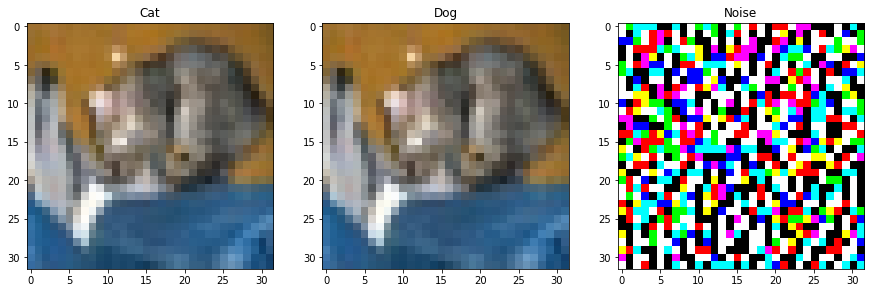
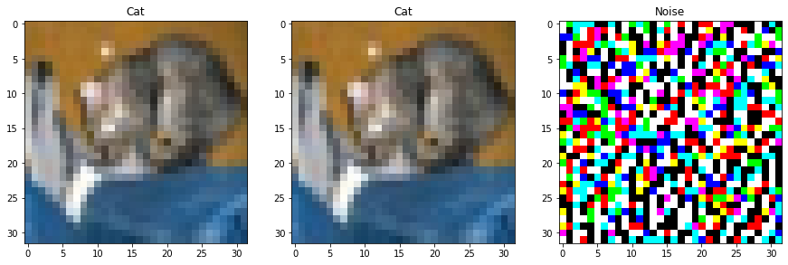

# Adversarial training

En este caso usé unas versiones modificadas de los modelos de [Torchvision models](https://pytorch.org/vision/stable/models.html) para que usen CIFAR10, el código para las arquitecturas lo tomé de [PyTorch models trained on CIFAR-10 dataset](https://github.com/huyvnphan/PyTorch_CIFAR10). Particularmente usé la versión modificada de [MobileNet v2](https://github.com/huyvnphan/PyTorch_CIFAR10/blob/master/cifar10_models/mobilenetv2.py), la cual entrené desde cero usando el dataset de entrenamiento de CIFAR10 y posteriomente entrené otro modelo agregando 20,000 ejemplos adversarios al dataset, lo que hace que el modelo sea más robusto a ataques adversarios. En la tabla de abajo de muestra el accuracy de cada modelo con los distintos ataques de caja blanca.

|        **Modelo**        | **Limpio (acc@1/acc@5)** | **FGSM (acc@1/acc@5)** | **PGD (acc@1/acc@5)** | **MIFGSM (acc@1/acc@5)** | **OnePixel (acc@1/acc@5)** |
|:------------------------:|:------------------------:|:----------------------:|:---------------------:|:------------------------:|:--------------------------:|
|       MobileNet v2       |           81.68          |          37.03         |         28.29         |           31.27          |            63.17           |
| MobileNet v2 Adversarial |           80.62          |          77.44         |         77.49         |           77.35          |            77.58           |

